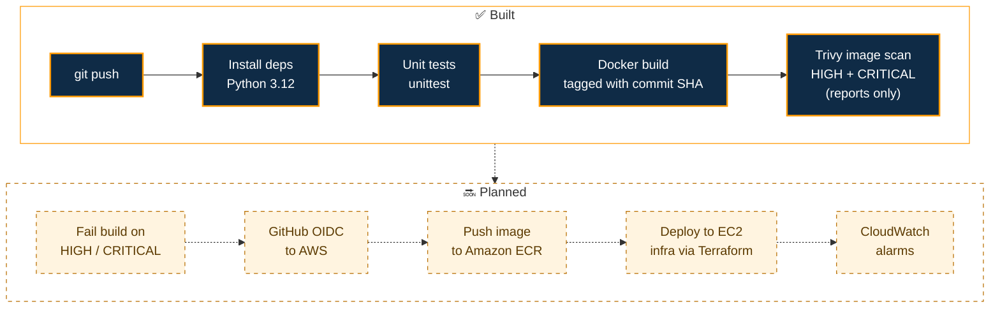

<!-- ============================== HEADER ============================== -->
<div align="center">
  
  <picture>
    <source media="(prefers-color-scheme: dark)" srcset="https://readme-typing-svg.demolab.com?font=JetBrains+Mono&weight=600&size=22&duration=3000&pause=1000&color=FF9900&center=true&vCenter=true&width=640&height=45&lines=Learning+Cloud+%26+DevOps+by+building;From+automobiles+to+the+cloud;Docker+%C2%B7+GitHub+Actions+%C2%B7+Trivy">
    
  </picture>
</div>

<p align="center">
  <b>B.Tech CSE graduate with nearly 4 years of customer-facing operations experience,<br/>now building a hands-on DevSecOps pipeline with Python, Docker, GitHub Actions and Trivy, with Terraform on AWS up next.</b>
</p>

<div align="center">

📍 Lucknow, Uttar Pradesh, India

[![Status: open to Cloud / DevOps roles][b-status]](#-lets-connect)
[![SecureOps CI workflow status][b-ci]](https://github.com/MOHDSAUD888/Secure-cloud-devsecops/actions/workflows/ci-cd.yml)

**[Featured: SecureOps Dashboard](#-secureops-dashboard-a-devsecops-pipeline)** &nbsp;·&nbsp;
**[Live portfolio](https://mohdsaud888.github.io/Mohd-Saud_Portfolio-Website/)** &nbsp;·&nbsp;
**[LinkedIn](https://www.linkedin.com/in/mohdsaud1/)** &nbsp;·&nbsp;
**[Email](mailto:mosaud1997@icloud.com)**

<sub>[At a glance](#-at-a-glance) · [Projects](#-featured-projects) · [Skills](#-skills) · [Journey](#-my-journey) · [Contact](#-lets-connect) · [Run this site](#-about-this-repository)</sub>

</div>

---

## 📌 At a Glance

<table>
  <tr><td><b>Looking for</b></td><td>Entry-level Cloud / DevOps roles and internships</td></tr>
  <tr><td><b>Education</b></td><td>B.Tech, Computer Science &amp; Engineering, AKTU Lucknow (graduated June 2026)</td></tr>
  <tr><td><b>Experience</b></td><td>Nearly 4 years as a Service Advisor at an authorised Maruti Suzuki dealership</td></tr>
  <tr><td><b>Hands-on</b></td><td>Python, Flask, Docker, GitHub Actions, Trivy, Git, GitHub Pages; Terraform (AWS provider configured, resources next)</td></tr>
  <tr><td><b>Certification</b></td><td>Preparing for AWS Solutions Architect – Associate (not yet certified)</td></tr>
  <tr><td><b>Location</b></td><td>Lucknow, Uttar Pradesh, India</td></tr>
</table>

**What I bring**

- A CI pipeline ([SecureOps](#-secureops-dashboard-a-devsecops-pipeline)) that tests, builds and Trivy-scans a Docker image on every push.
- Secrets hygiene from the start: Terraform state, `tfvars`, `.env` files and keys are kept out of Git.
- 3 years 8 months as a Service Advisor in a high-volume workshop: handling escalations, coordinating with technicians, and managing service documentation and billing.

---

## 🚀 Featured Projects

### 🔐 SecureOps Dashboard: a DevSecOps pipeline

[![Status: in progress][b-wip]](https://github.com/MOHDSAUD888/Secure-cloud-devsecops)
[![SecureOps CI workflow status][b-ci]](https://github.com/MOHDSAUD888/Secure-cloud-devsecops/actions/workflows/ci-cd.yml)
[![View repository][b-repo-secureops]](https://github.com/MOHDSAUD888/Secure-cloud-devsecops)

A small Flask app wrapped in a **DevSecOps pipeline**, built to practise how teams ship code safely. The point is the path from `git push` to a **tested, containerised and vulnerability-scanned image**, not the app itself: the dashboard is a static page, and its status cards are placeholders, not live data. The AWS deployment half is what I'm building next.



<sub>Solid boxes run in CI today. Dashed boxes are planned and not built yet.</sub>

<table>
  <tr>
    <th width="55%">✅ Built: in the repo today</th>
    <th width="45%">🔜 Planned next</th>
  </tr>
  <tr>
    <td valign="top">

- **[App](https://github.com/MOHDSAUD888/Secure-cloud-devsecops/tree/main/app):** Flask on Python 3.12 serving one static dashboard page (placeholder status cards, not live data), with a `unittest` check that `GET /` returns 200
- **[Container](https://github.com/MOHDSAUD888/Secure-cloud-devsecops/blob/main/docker/Dockerfile):** `python:3.12-slim` base, no pip cache, **Gunicorn** on port 5000, plus a `.dockerignore`
- **[CI](https://github.com/MOHDSAUD888/Secure-cloud-devsecops/blob/main/.github/workflows/ci-cd.yml):** the *SecureOps CI* workflow installs dependencies, runs the tests, builds the image tagged with the commit SHA and runs a **Trivy** scan for HIGH and CRITICAL vulnerabilities (reports findings, does not fail the build yet)
- **[Terraform](https://github.com/MOHDSAUD888/Secure-cloud-devsecops/blob/main/provider.tf):** AWS provider `~> 6.0` for `ap-south-1` (Mumbai), lock file committed, no resources defined yet
- **[Secrets hygiene](https://github.com/MOHDSAUD888/Secure-cloud-devsecops/blob/main/.gitignore):** `.gitignore` keeps Terraform state, `tfvars`, `.env` files, keys and AWS credentials out of Git

<sub>Each label links to the code in the repo.</sub>

</td>
    <td valign="top">

- Fail the pipeline on HIGH / CRITICAL findings
- Trivy IaC and filesystem scans
- GitHub OIDC to AWS, so no long-lived access keys
- Push the image to Amazon ECR
- Terraform: VPC, subnets, security groups and EC2
- Deploy the container to EC2
- Secrets Manager and a least-privilege IAM role
- CloudWatch alarms
- Remote Terraform state in S3, with state locking

</td>
  </tr>
</table>

<details>
<summary><b>💡 Design notes: the "why" behind each choice</b></summary>
<br/>

- **Why tag the image with the commit SHA?** Every image maps to exactly one commit, so a scan result can be traced back to the code that produced it. A shared `latest` tag can't do that. (The image isn't pushed to a registry yet; ECR is planned.)
- **Why `python:3.12-slim` and `--no-cache-dir`?** A smaller base image means fewer OS packages to patch and fewer findings for Trivy to report, and no pip cache gets baked into an image layer.
- **Why Gunicorn instead of `app.run()`?** Flask's built-in server is meant for development only. Gunicorn is a production-grade WSGI server, so the container doesn't rely on Flask's development server.
- **What does the Trivy step do today?** It scans the freshly built image for HIGH and CRITICAL vulnerabilities and skips ones with no fix available yet (`ignore-unfixed`), so the report stays actionable. It reports in the job log but does not fail the build; turning it into a hard gate is the next step.
- **Why keep `*.tfstate` and `*.tfvars` out of Git?** Terraform state and variable files can hold resource details and secrets in plain text. The plan is remote state in S3 with state locking, so state lives neither in Git nor on a laptop.
- **Why OIDC for AWS (planned)?** GitHub Actions can exchange a short-lived OIDC token for temporary AWS credentials scoped to one IAM role, so no long-lived access keys are stored as repository secrets.

</details>

<details>
<summary><b>📁 Repository layout and how to run it locally</b></summary>
<br/>

```text
Secure-cloud-devsecops/
├── app/
│   ├── app.py                  # Flask app, one route: GET /
│   ├── test_app.py             # unittest: GET / returns 200
│   ├── requirements.txt        # pinned versions (Flask, Gunicorn, ...)
│   ├── templates/index.html    # static dashboard page (placeholder cards)
│   └── static/style.css
├── docker/Dockerfile           # python:3.12-slim + Gunicorn on :5000
├── .github/workflows/ci-cd.yml # SecureOps CI: test -> build -> Trivy scan
├── provider.tf                 # Terraform AWS provider (~> 6.0), ap-south-1
├── .terraform.lock.hcl
├── .dockerignore
└── .gitignore                  # state, tfvars, .env, keys, AWS credentials
```

The same steps CI runs:

```bash
git clone https://github.com/MOHDSAUD888/Secure-cloud-devsecops.git
cd Secure-cloud-devsecops

pip install -r app/requirements.txt
python -m unittest discover app

docker build -t secureops:local -f docker/Dockerfile .
docker run --rm -p 5000:5000 secureops:local      # open http://localhost:5000

# optional: the same scan CI runs (needs Trivy installed)
trivy image --severity HIGH,CRITICAL --ignore-unfixed secureops:local
```

</details>

### 🌐 Portfolio Website: this repository

[![Status: completed][b-done]](#-portfolio-website-this-repository)
[![Open live site][b-live]](https://mohdsaud888.github.io/Mohd-Saud_Portfolio-Website/)

My personal portfolio, built with **plain HTML, CSS and JavaScript**: no framework and no build step. The design is based on [Habib Ur Rehman's portfolio](https://habib277672.github.io/Personal-Portfolio/) (same layout, colours, fonts and animations), with my own content and photos.

- **Excel as a CMS:** profile, projects, experience, skills and testimonials live in [`portfolio-data.xlsx`](portfolio-data.xlsx). Edit it in Excel, upload it to GitHub, and the site updates, no code needed. A Google Sheet can be connected instead via `SHEET_URL`. If neither can be read, the site falls back to the defaults in [`data.js`](assets/js/data.js).
- **Spreadsheet content treated as untrusted:** every value is HTML-escaped, and links are limited to `http(s)`, `mailto` or relative paths before rendering.
- **Pipeline on scroll:** a section that replays the real SecureOps CI workflow (push, install, test, build, Trivy scan) one stage at a time as you scroll, with a link to the code behind each stage and a live CI status badge. With "reduce motion" switched on, it shows as a static list.
- **No external CDN:** fonts (Montserrat, Unbounded), libraries (Swiper, anime.js, ScrollReveal, SheetJS) and icons (Remix Icon, as an inline SVG sprite) are all served from this repository.

<details>
<summary><b>⚙️ Under the hood: how the content loads</b></summary>
<br/>

| How it works | Why it matters |
| :-- | :-- |
| **Spreadsheet first, defaults as backup** | [`main.js`](assets/js/main.js) reads `portfolio-data.xlsx` (or the Google Sheet, if `SHEET_URL` is set) with a 3-second timeout. If that fails, it renders the content in [`data.js`](assets/js/data.js), so the page never stays blank. |
| **Per-tab fallback** | Each tab is checked for its required columns. A tab that is missing, or has the wrong columns, is skipped and keeps its defaults. For a Google Sheet the tabs load in parallel with `Promise.allSettled`, and the column check matters because Google returns the *first* tab when a tab name is wrong. |
| **One-line theming** | Change `--hue` in [`styles.css`](assets/css/styles.css) to recolour the whole site. |
| **Zero tooling** | No bundler and no `node_modules`. Serve the folder with any static server; it's set up for free hosting on GitHub Pages from the `main` branch. |

</details>

Want to run it, deploy it or edit its content? See [About this repository](#-about-this-repository).

---

## 🧰 Skills

**✅ Hands-on: used in my public repositories**

| Area | Tools |
| :-- | :-- |
| Code & testing |     |
| Containers & CI |    |
| Infrastructure as Code |  <br/> AWS provider configured for `ap-south-1`; resources are next |
| Web |      |
| Version control |   |

**📚 Learning and practising: labs and coursework, not production experience yet**

| Area | Tools and topics |
| :-- | :-- |
| Cloud | ![AWS][b-aws]  <br/> EC2 · S3 · VPC · IAM · ECR · Route 53 · Secrets Manager · CloudWatch · Google Cloud Skills Boost labs |
| Systems |     <br/> Windows Server |
| Networking | TCP/IP · DNS · DHCP · HTTP/HTTPS · VPC subnetting · routing tables · firewalls · security groups |
| Data & tools |    |

<details>
<summary><b>🔎 Where to see each hands-on skill</b></summary>
<br/>

| Skill | Where to see it |
| :-- | :-- |
| Python, Flask | [`app/app.py`](https://github.com/MOHDSAUD888/Secure-cloud-devsecops/blob/main/app/app.py) |
| Unit testing (`unittest`) | [`app/test_app.py`](https://github.com/MOHDSAUD888/Secure-cloud-devsecops/blob/main/app/test_app.py) |
| Docker, Gunicorn | [`docker/Dockerfile`](https://github.com/MOHDSAUD888/Secure-cloud-devsecops/blob/main/docker/Dockerfile) |
| GitHub Actions CI, Trivy | [`.github/workflows/ci-cd.yml`](https://github.com/MOHDSAUD888/Secure-cloud-devsecops/blob/main/.github/workflows/ci-cd.yml) |
| Terraform (provider setup only so far) | [`provider.tf`](https://github.com/MOHDSAUD888/Secure-cloud-devsecops/blob/main/provider.tf) |
| Secrets hygiene in Git | [`.gitignore`](https://github.com/MOHDSAUD888/Secure-cloud-devsecops/blob/main/.gitignore) |
| HTML, CSS, JavaScript | [`index.html`](index.html), [`styles.css`](assets/css/styles.css), [`main.js`](assets/js/main.js) |
| Excel / Google Sheets as a lightweight CMS | [`portfolio-data.xlsx`](portfolio-data.xlsx), [`data.js`](assets/js/data.js) and the loader in [`main.js`](assets/js/main.js) |

</details>

---

## 🧭 My Journey


I started in automobiles. After a Diploma in Automobile Engineering, I spent **nearly 4 years as a Service Advisor** at an authorised Maruti Suzuki dealership in Lucknow, the link between customers and a busy workshop. That job built the habits I bring to Cloud / DevOps work: handling escalations, coordinating across people, keeping documentation accurate, working under pressure and owning the outcome.

I hold a **B.Tech in Computer Science & Engineering** from AKTU, and I'm learning Cloud and DevOps by building small projects in public. Long term, I want to specialise in **Cloud Security**.

- **Building:** [SecureOps Dashboard](#-secureops-dashboard-a-devsecops-pipeline), a DevSecOps CI pipeline
- **Learning:** AWS (preparing for Solutions Architect – Associate), Terraform, Linux and networking, Google Cloud Skills Boost labs
- **Ask me about:** switching from automobiles to tech, Docker, CI pipelines

<br clear="right"/>

| When | Milestone |
| :-- | :-- |
| **2018** | Diploma in Automobile Engineering, Integral University, Lucknow |
| **Sep 2019 – May 2023** | Service Advisor, Oneup Motors India Pvt. Ltd. (authorised Maruti Suzuki dealership), Lucknow · 3 years 8 months |
| **June 2026** | B.Tech, Computer Science & Engineering, Dr. A.P.J. Abdul Kalam Technical University (AKTU), Lucknow |

---

## 🤝 Let's Connect

I'm open to **entry-level Cloud / DevOps roles and internships**. If you're hiring, or just want to talk about cloud, I'd love to hear from you.

<div align="center">

[![LinkedIn][b-linkedin]](https://www.linkedin.com/in/mohdsaud1/)
[![Email][b-email]](mailto:mosaud1997@icloud.com)
[![Live portfolio][b-portfolio]](https://mohdsaud888.github.io/Mohd-Saud_Portfolio-Website/)
[![GitHub][b-github]](https://github.com/MOHDSAUD888)

</div>

---

## 📂 About This Repository

This repository is the source of my portfolio website. Everything you need to run, deploy or edit it is below.

<details>
<summary><b>📁 Project structure</b></summary>
<br/>

```text
index.html              page structure (sections) + icon sprite
portfolio-data.xlsx     ALL the content (edit this)
assets/css/styles.css   all design (change --hue to change the theme colour)
assets/js/data.js       fallback content + SHEET_URL setting
assets/js/main.js       loads the content, renders the sections, animations
assets/img/             photos (and project screenshots)
assets/fonts/           Montserrat + Unbounded (self-hosted, no Google Fonts call)
assets/pdf/             resume
assets/vendor/          third-party libraries (see Credits)
```

</details>

<details>
<summary><b>💻 Run locally</b></summary>
<br/>

No install needed. Any static file server works:

```bash
git clone https://github.com/MOHDSAUD888/Mohd-Saud_Portfolio-Website.git
cd Mohd-Saud_Portfolio-Website
python3 -m http.server 8000
# open http://localhost:8000
```

</details>

<details>
<summary><b>🚀 Deploy for free with GitHub Pages</b></summary>
<br/>

1. Open the repo **Settings → Pages**.
2. Source: **Deploy from a branch** → branch **`main`**, folder **`/ (root)`** → **Save**.
3. After a minute or two the site is live at `https://mohdsaud888.github.io/Mohd-Saud_Portfolio-Website/`.

</details>

<details>
<summary><b>📊 Edit content with Excel (no code)</b></summary>
<br/>

1. Download [`portfolio-data.xlsx`](portfolio-data.xlsx) and open it in Excel.
2. Edit the tabs **Profile**, **Projects**, **Experience**, **Services** and **Testimonials** (the **How to use** tab inside the file repeats these rules).
3. Save it with the same name.
4. On GitHub: **Add file → Upload files** → drop the file → **Commit changes**.
5. Wait 1-2 minutes and refresh the website.

**Rules**

- Keep the tab names exactly: `Profile`, `Projects`, `Experience`, `Services`, `Testimonials`.
- Do not rename the column headers (first row) or the `key` names in `Profile`. In `Profile`, only change the `value` column.
- Multiple items in one cell → separate them with commas (`AWS, Terraform, Docker`). New line in a cell → **Alt+Enter**.
- `visible` = `no` hides a row. Testimonials stay hidden until you add one.
- `hero_role` is the animated title in the hero; its last word goes on the white line.
- In `about_text`, wrap words in `**double stars**` to highlight them in the theme colour (purple by default).
- If a tab can't be read, the site uses `data.js` for that tab, so the page still shows content.

**Optional: live editing with Google Sheets.** Upload the file to Google Drive → open it with Google Sheets → **Share → Anyone with the link → Viewer**, then paste the sheet link into `SHEET_URL` at the top of [`assets/js/data.js`](assets/js/data.js). Edits in the sheet then show up after a refresh, without uploading anything. If a value disappears on the site, select the column → **Format → Number → Plain text**.

</details>

<details>
<summary><b>🖼️ Add a project screenshot</b></summary>
<br/>

Put the image in `assets/img/` (for example `project-1.png`) and write `assets/img/project-1.png` in the `image` column of the `Projects` tab.

</details>

<details>
<summary><b>🎨 Change the theme colour</b></summary>
<br/>

Open [`assets/css/styles.css`](assets/css/styles.css) and change `--hue` at the top (default `255`). Every accent colour on the site is derived from it.

</details>

<details>
<summary><b>🙏 Credits</b></summary>
<br/>

- Design based on [Habib Ur Rehman's portfolio](https://habib277672.github.io/Personal-Portfolio/) ("Panda Coders").
- Built with AI pair-programming (Claude).

| Library | Used for | License |
| :-- | :-- | :-- |
| [Swiper](https://swiperjs.com) 11.2.10 | projects carousel | MIT |
| [anime.js](https://animejs.com) 4.1.4 | animated title letters | MIT |
| [ScrollReveal](https://scrollrevealjs.org) 4.0.9 | scroll animations | GPL-3.0 (free for non-commercial / open-source use) |
| [SheetJS](https://sheetjs.com) 0.20.3 (mini) | reading the Excel file in the browser | Apache-2.0 |
| [Remix Icon](https://remixicon.com) 4.6.0 | icons (inline SVG sprite) | Apache-2.0 |
| Montserrat, Unbounded | fonts (self-hosted) | SIL Open Font License |

</details>

<!-- ============================== FOOTER ============================== -->
<div align="center">
  
</div>

<!--
  GitHub stats cards: hidden for now. Re-enable once there is more public activity.

  <div align="center">
    
    
  </div>
-->

<!-- Badge definitions. The custom icons are Remix Icon glyphs taken from this site's own SVG sprite (index.html). -->
[b-ci]: https://img.shields.io/github/actions/workflow/status/MOHDSAUD888/Secure-cloud-devsecops/ci-cd.yml?branch=main&style=for-the-badge&label=SecureOps%20CI&logo=githubactions&logoColor=white&labelColor=0f2b46
[b-status]: https://img.shields.io/badge/Status-Open_to_Cloud_%2F_DevOps_roles-ffd28a?style=for-the-badge&labelColor=0f2b46&logo=data%3Aimage%2Fsvg%2Bxml%3Bbase64%2CPHN2ZyB4bWxucz0iaHR0cDovL3d3dy53My5vcmcvMjAwMC9zdmciIHZpZXdCb3g9IjAgMCAyNCAyNCI%2BPHBhdGggZmlsbD0iI2ZmOTkwMCIgZD0iTTcgNVYyQzcgMS40IDcuNCAxIDggMUgxNkMxNi42IDEgMTcgMS40IDE3IDJWNUgyMUMyMS42IDUgMjIgNS40IDIyIDZWMjBDMjIgMjAuNiAyMS42IDIxIDIxIDIxSDNDMi40IDIxIDIgMjAuNiAyIDIwVjZDMiA1LjQgMi40IDUgMyA1SDdaTTE1IDdIOVYxOUgxNVY3Wk03IDdINFYxOUg3VjdaTTE3IDdWMTlIMjBWN0gxN1pNOSAzVjVIMTVWM0g5WiIvPjwvc3ZnPg%3D%3D
[b-aws]: https://img.shields.io/badge/AWS-0f2b46?style=for-the-badge&logo=data%3Aimage%2Fsvg%2Bxml%3Bbase64%2CPHN2ZyB4bWxucz0iaHR0cDovL3d3dy53My5vcmcvMjAwMC9zdmciIHZpZXdCb3g9IjAgMCAyNCAyNCI%2BPHBhdGggZmlsbD0iI2ZmOTkwMCIgZD0iTTEyIDJDMTUuOSAyIDE5IDUuMSAxOSA5QzE5IDkuMSAxOSA5LjIgMTkgOS4zQzIxLjMgMTAuMiAyMyAxMi40IDIzIDE1QzIzIDE4LjMgMjAuMyAyMSAxNyAyMUg3QzMuNyAyMSAxIDE4LjMgMSAxNUMxIDEyLjQgMi43IDEwLjIgNSA5LjNDNSA5LjIgNSA5LjEgNSA5QzUgNS4xIDguMSAyIDEyIDJaTTEyIDRDOS4yIDQgNyA2LjIgNyA5QzcgOS4xIDcgOS4yIDcgOS4yTDcuMSAxMC43TDUuNyAxMS4yQzQuMSAxMS44IDMgMTMuMyAzIDE1QzMgMTcuMiA0LjggMTkgNyAxOUgxN0MxOS4yIDE5IDIxIDE3LjIgMjEgMTVDMjEgMTIuOCAxOS4yIDExIDE3IDExQzE1LjIgMTEgMTMuNyAxMi4xIDEzLjIgMTMuN0wxMS4zIDEzLjFDMTIuMSAxMC43IDE0LjMgOSAxNyA5QzE3IDYuMiAxNC44IDQgMTIgNFoiLz48L3N2Zz4%3D
[b-wip]: https://img.shields.io/badge/Status-In_progress-ffd28a?style=for-the-badge&labelColor=0f2b46
[b-done]: https://img.shields.io/badge/Status-Completed-238636?style=for-the-badge&labelColor=0f2b46
[b-repo-secureops]: https://img.shields.io/badge/View_repository-0f2b46?style=for-the-badge&logo=github&logoColor=ffd28a
[b-live]: https://img.shields.io/badge/Open_live_site-0f2b46?style=for-the-badge&logo=data%3Aimage%2Fsvg%2Bxml%3Bbase64%2CPHN2ZyB4bWxucz0iaHR0cDovL3d3dy53My5vcmcvMjAwMC9zdmciIHZpZXdCb3g9IjAgMCAyNCAyNCI%2BPHBhdGggZmlsbD0iI2ZmZDI4YSIgZD0iTTE2IDkuNEw3LjQgMThMNiAxNi42TDE0LjYgOEg3VjZIMThWMTdIMTZWOS40WiIvPjwvc3ZnPg%3D%3D
[b-linkedin]: https://img.shields.io/badge/LinkedIn-0f2b46?style=for-the-badge&logo=data%3Aimage%2Fsvg%2Bxml%3Bbase64%2CPHN2ZyB4bWxucz0iaHR0cDovL3d3dy53My5vcmcvMjAwMC9zdmciIHZpZXdCb3g9IjAgMCAyNCAyNCI%2BPHBhdGggZmlsbD0iI2ZmZDI4YSIgZD0iTTYuOSA1QzYuOSA1LjggNi40IDYuNSA1LjcgNi45QzQuOSA3LjIgNC4xIDcgMy41IDYuNEMyLjkgNS44IDIuOCA0LjkgMy4xIDQuMkMzLjQgMy40IDQuMiAzIDUgM0M2LjEgMyA2LjkgMy45IDYuOSA1Wk03IDguNUgzVjIxSDdWOC41Wk0xMy4zIDguNUg5LjNWMjFIMTMuM1YxNC40QzEzLjMgMTAuOCAxOC4xIDEwLjQgMTguMSAxNC40VjIxSDIyVjEzLjFDMjIgNi45IDE0LjkgNy4xIDEzLjMgMTAuMkwxMy4zIDguNVoiLz48L3N2Zz4%3D
[b-email]: https://img.shields.io/badge/Email-0f2b46?style=for-the-badge&logo=data%3Aimage%2Fsvg%2Bxml%3Bbase64%2CPHN2ZyB4bWxucz0iaHR0cDovL3d3dy53My5vcmcvMjAwMC9zdmciIHZpZXdCb3g9IjAgMCAyNCAyNCI%2BPHBhdGggZmlsbD0iI2ZmZDI4YSIgZD0iTTMgM0gyMUMyMS42IDMgMjIgMy40IDIyIDRWMjBDMjIgMjAuNiAyMS42IDIxIDIxIDIxSDNDMi40IDIxIDIgMjAuNiAyIDIwVjRDMiAzLjQgMi40IDMgMyAzWk0yMCA3LjJMMTIuMSAxNC4zTDQgNy4yVjE5SDIwVjcuMlpNNC41IDVMMTIuMSAxMS43TDE5LjUgNUg0LjVaIi8%2BPC9zdmc%2B
[b-portfolio]: https://img.shields.io/badge/Portfolio-0f2b46?style=for-the-badge&logo=data%3Aimage%2Fsvg%2Bxml%3Bbase64%2CPHN2ZyB4bWxucz0iaHR0cDovL3d3dy53My5vcmcvMjAwMC9zdmciIHZpZXdCb3g9IjAgMCAyNCAyNCI%2BPHBhdGggZmlsbD0iI2ZmZDI4YSIgZD0iTTE2IDkuNEw3LjQgMThMNiAxNi42TDE0LjYgOEg3VjZIMThWMTdIMTZWOS40WiIvPjwvc3ZnPg%3D%3D
[b-github]: https://img.shields.io/badge/GitHub-0f2b46?style=for-the-badge&logo=github&logoColor=ffd28a
